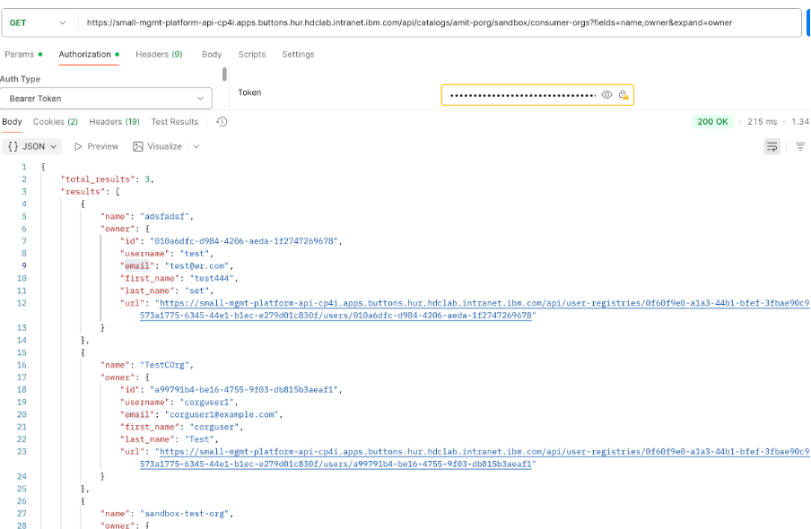
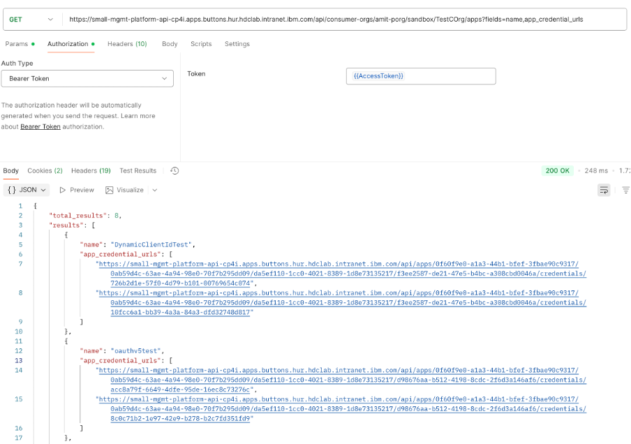
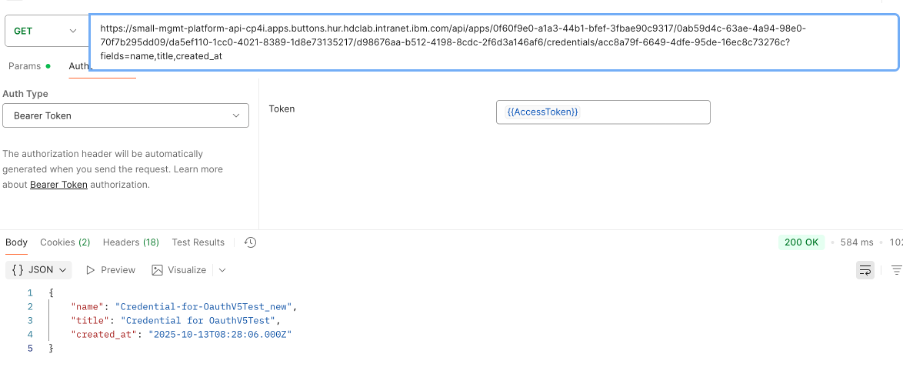
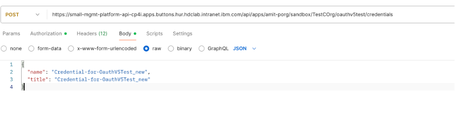
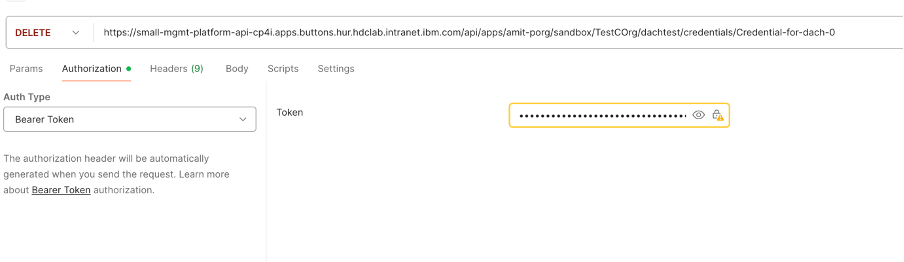
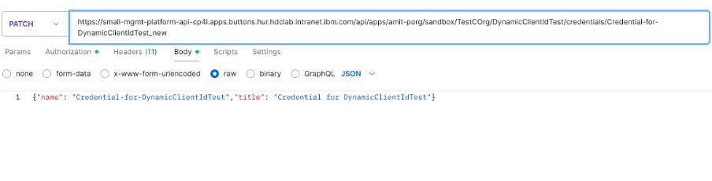

Client credentials in IBM API Connect (APIC) are used for authentication and authorization for applications which need to access protected APIs. There are two main types of client credentials:
Client ID: A unique identifier for the client application or service. 
Client Secret: A secret key known only to the client and the API Connect gateway. 

It is used to ensure that only authorized clients can access protected APIs and resources.

The client credentials created within IBM APIC does not have any expiry time but recently we are seeing many customers looking for these client credentials to get expired in certain number of days specified with a new one in place from security perspective. 

There is no out of box feature as of now in IBM APIC for this but it can be achieved using platform Rest APIs provided by APIC.  You can automate the client credentials rotation using the Rest APIs available.

*Note: WHen you have rotated secrets you must ensure your application calling the apis also has the credentials updated*

<!--more-->


1)	Get the consumer orgs for a catalog

```
GET  https://{platformapiendpoint}/api/catalogs/{progname}/{catalogname}/consumer-orgs?fields=name, owner&expand=owner
```

It will provide you a json response with all consumer org names along with its owner details available in a catalog.


 
2)	Get the apps for each consumer org

```

GET  https://{platformapiendpoint}/consumer-orgs/{progname}/{catalogname}/{consumerorgname}/apps?fields=name,app_credential_urls
```

This endpoint will return a json response with app name and its corresponding credential url endpoints. 


3)	For each app of a consumer org check the app’s credentials creation date by using the app_credential_urls received in step 2.


4)	For each app’s credentials calculate the delta days between current time/date and created_at from the response in step 3 to check whether this credential need to get rotated.

5)	Send an email to consumer org owner for resetting the client credentials which needs rotation by providing corresponding app and credential name/title as part of email.  Consumer owner email is available as part of response from step 1 api call.

OR

In case you want to completely automate rotation of client credentials then after step 4 follow below steps.
     
6)	Create a new client credential if delta days is greater than equal to expiry days ( as per what defined by organization 90,120 days etc)  and less than expected no of days for credential to remove ( say delete the expired cred after expiry + 10 days) 

```
POST https://{platformapiendpoint}/apps/{progname}/{catalogname}/{consumerorgname}/{appname}/ /credentials
```


Note:  Pass name & title for POST call with ‘_new’ appended to original one. 

It will return the credentials information which gets created along with clientId and clientSecret as part of response. 


 

7.  Get the clientId and clientSecret from the response and send a secure email to Consumer with credentials details including app and cred information or store in file and share across manually or whatever secure way you wanted it to be shared across to consumer. 

8.  If created date is greater than expected no of days for credential to remove and there exist more than one credentials (to make sure at any time we have one active credential)

•	Delete old credential
```
DELETE https://{platformapiendpoint}/apps/{progname}/{catalogname}/{consumerorgname}/{appname}/ /credentials/{credentialname}
```



•	Update the newly created credentials with cred name and title to original one to make sure we didn't keep on creating credentials with _new appended each time and always have atmost two with original cred name and with _new appended at a time.
```
PATCH  https://{platformapiendpoint}/apps/{progname}/{catalogname}/{consumerorgname}/{appname}/ /credentials/{credentialname}
```



9.   Raise an error if created date is greater than expected no of days for credential to remove
      but there exist only one credential, that is new credential not created


Link for Platform API Docs - https://apic-api.apiconnect.ibmcloud.com/v10/#/IBMAPIConnectPlatformProviderAPI_200/operation/%2Fcatalogs%2F{org}%2F{catalog}%2Fconsumer-orgs/get


```python
Sample Python Script utilizing the Platform Rest APIs to achieve the same as described above-

import json
import sys
import requests
from datetime import datetime, timezone
from urllib3.exceptions import InsecureRequestWarning
requests.packages.urllib3.disable_warnings(category=InsecureRequestWarning)

ExpiryDays=90
DeletionDays=100
current_time = datetime.now(timezone.utc)
outputdir=”directoryforwritingcredcredential" 

porg = 'porgname'
catalog = 'catalogname'
providerurl= 'platformapiendpoint'
tokenurl = providerurl + 'token'

tokendata = {"username": "username","password": "password","realm": "provider/default-idp-2",\
              "client_id": "clientID","client_secret": "clientsecretvalue","grant_type": "password"}

tokenheaders = {'Content-Type': 'application/json'}

tokenresponse = requests.post(tokenurl, headers=tokenheaders, data=json.dumps(tokendata), verify=False)

access_token = tokenresponse.json()['access_token']

authheaders = {'Authorization': 'Bearer ' + access_token,'Content-Type': 'application/json'}

# Get all consumer orgs for a catalog in prog
consumerorgsresp = requests.get(providerurl+'catalogs/'+porg+'/'+catalog+'/consumer-orgs?fields=name', headers=authheaders, verify=False, timeout=15)
if(consumerorgsresp.status_code!=200):
       print("InsideConsumerOrgsResp")
       print(consumerorgsresp.content)
       sys.exit(1)
consumerorgsresp = consumerorgsresp.json()

total = consumerorgsresp['total_results']
consumerorgresults = consumerorgsresp['results']
print("No of consumers in " + porg + "->" + catalog + " are " + str(total))

# Loop through all consumers orgs
for consumerorgresult in consumerorgresults:
    # Get all apps for a consumer org
    appsresp = requests.get(providerurl+'consumer-orgs/'+porg+'/'+catalog+'/'+consumerorgresult['name']+'/apps?fields=name,app_credential_urls', headers=authheaders, verify=False, timeout=15)
    if(appsresp.status_code!=200):
       print("InsideAppsResp")
       print(appsresp.content)
       sys.exit(1)
    appsrespjson =appsresp.json()
    appresults = appsrespjson['results']
    # Loop through the app result
    for appresult in appresults:
        credentialurls = appresult['app_credential_urls']
        # Check no of credential for an app
        credurlsize = len(credentialurls)
        print(appresult['name'] + " -> "   + " -> " + str(credurlsize))
        # Loop through the credentials of an app
        for credentialurl in credentialurls:
            # Get the credential details - name,title and created time
            credentialresp = requests.get(credentialurl+'?fields=name,title,created_at', headers=authheaders, verify=False, timeout=15)
            if(credentialresp.status_code!=200):
                print("InsideCredentialResp")
                print(credentialresp.content)
                sys.exit(1)
            credentialresp = credentialresp.json()

            # Calculate delta days between current time and credential created time
            createdat = datetime.fromisoformat(credentialresp['created_at'][:-1]).replace(tzinfo=timezone.utc)
            timediff = current_time - createdat
            diffdays = timediff.days
            print(appresult['name']+"_"+credentialresp['name']+" -> "+ str(createdat) + " -> "+ str(diffdays)+" days")

            # Create a new credential if credential created date is greater than equal to expected 
            # expiry no of days but less than expected no of days for credential to remove
            if diffdays >=ExpiryDays and diffdays <DeletionDays:
               createcred = {"name": credentialresp['name']+"_new","title": credentialresp['title']+"_new"}
               addcredresp = requests.post(providerurl+"apps/"+porg+"/"+catalog+"/"+consumerorgresult['name']+"/"+appresult['name']+"/credentials", headers=authheaders, data=json.dumps(createcred), verify=False, timeout=15)
               # Check if credential not sucessfully created or already new credential exist
               if(addcredresp.status_code!=201 and addcredresp.status_code!=409):
                 print("Insideaddcredresp")
                 print(addcredresp.content)
                 sys.exit(1)
               # Write the response to a file only if credential sucessfully created
               if(addcredresp.status_code!=409):
                  with open(outputdir+appresult['name']+"_"+credentialresp['name']+".json", "w") as json_file:
                     json.dump(addcredresp.json(), json_file, indent=4)
            
            # Delete old credential if created date is greater than expected no of days for credential to remove
            # And there exist more than one credentials (to make sure at any time we have one active credential)
            elif diffdays>=DeletionDays and credurlsize!=1: 
                 #delete old cred
                 delcredresp = requests.delete(providerurl+"apps/"+porg+"/"+catalog+"/"+consumerorgresult['name']+"/"+appresult['name']+"/credentials/"+credentialresp['name'], headers=authheaders, verify=False, timeout=15)
                 if(delcredresp.status_code!=200):
                    print("InsideDelcredresp")
                    print(delcredresp.content)
                    sys.exit(1)
                
                 # update cred name and title to original one to make sure we didn't keep on 
                 # creating credentials with _new appended each time and always have atmost
                 # two with original cred name and with _new appended at a time
                 updatecred = {"name": credentialresp['name'],"title": credentialresp['title']}
                 updatenewcredresp = requests.patch(providerurl+"apps/"+porg+"/"+catalog+"/"+consumerorgresult['name']+"/"+appresult['name']+"/credentials/"+credentialresp['name']+"_new", headers=authheaders, data=json.dumps(updatecred), verify=False, timeout=15)
                 if(updatenewcredresp.status_code!=200):
                     print("Insideupdatenewcredresp")
                     print(updatenewcredresp)
                     sys.exit(1)
            
            # Raise an error if created date is greater than expected no of days for credential to remove
            # but there exist only one credential, that is new credential not created
            elif diffdays>=DeletionDays and credurlsize==1: 
                # raise error
                 print("Old Credential deletion date passed but it seems new not provisioned and old still exist ")
```


*Note:  Above script is a sample script which helps to understand and can be used to automate client credentials. It can be adjusted accordingly as per custom needs, but be cautious to test it well and validate to be confident before putting in an environment where actual consumer users exist to avoid causing any outages/issues to them. 

*